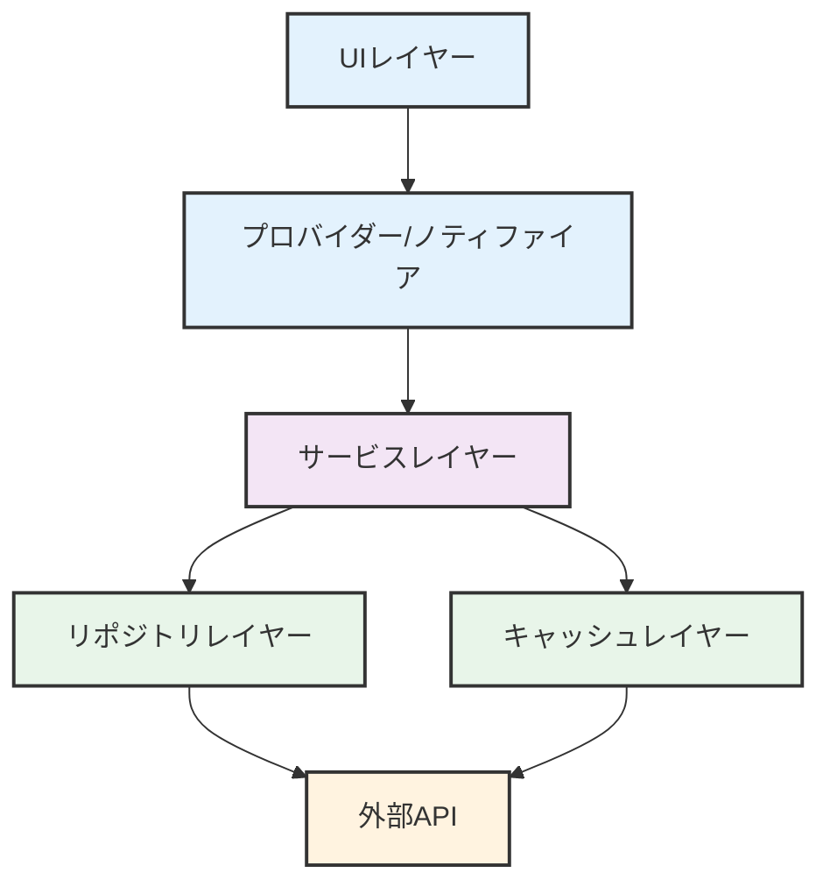

# DiaryQuest - 外部APIとサービス統合

## APIアーキテクチャ概要

DiaryQuestはコア機能を提供するために複数の外部サービスと統合されています。APIレイヤーは、適切なエラーハンドリング、キャッシュ、フォールバックメカニズムを持つサービス指向アーキテクチャに従っています。

## 外部サービス

### 1. OpenAI API

#### GPT-4o統合
**目的**: 日記エントリーのAIパワー分析によるゲーム化
**エンドポイント**: `https://api.openai.com/v1/chat/completions`
**認証**: Bearerトークン（APIキー）
**レート制限**: OpenAIサービスによる適用
**タイムアウト**: 30秒

#### サービス実装
```dart
// lib/core/services/openai_service.dart

class OpenAIService {
  final String apiKey;
  final String model;
  static const String _baseUrl = 'https://api.openai.com/v1/chat/completions';

  OpenAIService({required this.apiKey, this.model = 'gpt-4o'});

  Future<QuestAnalysisResult> analyzeQuestReport(
    String transcript,
    String navigatorPersonality,
  ) async {
    final prompt = _buildAnalysisPrompt(transcript, navigatorPersonality);

    final response = await http.post(
      Uri.parse(_baseUrl),
      headers: {
        'Content-Type': 'application/json',
        'Authorization': 'Bearer $apiKey',
      },
      body: jsonEncode({
        'model': model,
        'messages': [
          {'role': 'system', 'content': _systemPrompt},
          {'role': 'user', 'content': prompt},
        ],
        'response_format': {'type': 'json_object'},
        'temperature': 0.7,
      }),
    );

    if (response.statusCode != 200) {
      throw Exception('OpenAI API error: ${response.statusCode}');
    }

    final data = jsonDecode(response.body);
    final content = data['choices'][0]['message']['content'];
    return QuestAnalysisResult.fromJson(jsonDecode(content));
  }
}
```

#### API設定
```dart
// lib/core/config/app_config.dart

class AppConfig {
  static const String openAiApiKey = String.fromEnvironment('OPENAI_API_KEY');
  static const String openAiModel = 'gpt-4o';

  // GPT-4oが利用できない場合のフォールバックモデル
  static const String fallbackModel = 'gpt-3.5-turbo';

  // APIタイムアウト設定
  static const Duration apiTimeout = Duration(seconds: 30);

  // リトライ設定
  static const int maxRetries = 3;
  static const Duration retryDelay = Duration(seconds: 2);
}
```

#### リクエストペイロード構造
```json
{
  "model": "gpt-4o",
  "messages": [
    {
      "role": "system",
      "content": "あなたは「ダイクエ（Diary Quest）」というアプリのAIアシスタントです..."
    },
    {
      "role": "user",
      "content": "【ナビゲーター性格】: analytical\n【本日の報告】:\n今日は新しいプログラミング言語を学び始めた..."
    }
  ],
  "response_format": {"type": "json_object"},
  "temperature": 0.7
}
```

####レスポンススキーマ
```json
{
  "choices": [
    {
      "message": {
        "role": "assistant",
        "content": "{\"summary\": \"新しい技術を学習し、基礎的な文法を理解できた\", \"reframedContent\": \"新しいスキルを習得する挑戦に成功し、成長の機会を掴んだ\", \"earnedExp\": {\"analysis\": 15, \"expertise\": 12}, \"navigatorComment\": \"素晴らしい！分析能力の向上が見られます\"}"
      }
    }
  ]
}
```

#### エラーハンドリング
```dart
// OpenAI APIエラーコードとハンドリング
enum OpenAIError {
  invalidApiKey('401', '無効なAPIキー'),
  quotaExceeded('429', 'APIクォータ超過'),
  rateLimit('429', 'レート制限超過'),
  serverError('500', '内部サーバーエラー'),
  timeout('408', 'リクエストタイムアウト'),
  badRequest('400', '不正なリクエスト'),
}

class OpenAIException implements Exception {
  final String code;
  final String message;
  final DateTime timestamp;

  OpenAIException(this.code, this.message) : timestamp = DateTime.now();

  factory OpenAIException.fromResponse(int statusCode, String body) {
    // レスポンス本文からエラーを解析
    return OpenAIException(statusCode.toString(), 'OpenAI API error');
  }

  bool get isRetryable => [
    OpenAIError.rateLimit.code,
    OpenAIError.serverError.code,
    OpenAIError.timeout.code
  ].contains(code);
}
```

### 2. Firebaseサービス

#### 認証サービス
**目的**: ユーザー認証とセッション管理
**SDK**: `firebase_auth`
**機能**:
- メール/パスワード認証
- 匿名認証
- セッション永続化
- ユーザープロフィール管理

```dart
// lib/core/services/auth_service.dart

class AuthService {
  final FirebaseAuth _auth = FirebaseAuth.instance;

  Future<User?> signInWithEmailAndPassword(String email, String password) async {
    try {
      final credential = await _auth.signInWithEmailAndPassword(
        email: email,
        password: password,
      );
      return credential.user;
    } on FirebaseAuthException catch (e) {
      throw _handleAuthError(e);
    }
  }

  Future<User?> signInAnonymously() async {
    try {
      final credential = await _auth.signInAnonymously();
      return credential.user;
    } on FirebaseAuthException catch (e) {
      throw _handleAuthError(e);
    }
  }

  AuthException _handleAuthError(FirebaseAuthException e) {
    return AuthException(
      code: e.code,
      message: _getAuthErrorMessage(e.code),
    );
  }
}
```

#### Firestoreデータベース
**目的**: データ永続化とリアルタイム同期
**SDK**: `cloud_firestore`
**機能**:
- リアルタイムデータ同期
- オフライン機能
- 複雑なクエリ
- セキュリティルール

```dart
// Firestoreセキュリティルール
rules_version = '2';
service cloud.firestore {
  match /databases/{database}/documents {
    // Usersコレクション - ユーザーは自分のデータにのみアクセス可能
    match /users/{userId} {
      allow read, write: if request.auth != null && request.auth.uid == userId;
    }

    // Questsサブコレクション - ユーザーは自分のクエストにのみアクセス可能
    match /users/{userId}/quests/{questId} {
      allow read, write: if request.auth != null && request.auth.uid == userId;
    }

    // 分析用の管理者アクセス
    match /users/{userId} {
      allow read: if isAdmin();
      allow write: if isAdmin();
    }
  }
}
```

#### Firebase設定
```dart
// lib/firebase_options.dart

const firebaseConfig = FirebaseOptions(
  apiKey: "AIza...",
  authDomain: "diaryquest.firebaseapp.com",
  projectId: "diaryquest",
  storageBucket: "diaryquest.appspot.com",
  messagingSenderId: "123456789",
  appId: "1:123456789:web:abcdef123456",
);
```

### 3. 音声認識サービス

#### speech_to_text統合
**目的**: 日記入力用の音声テキスト変換
**SDK**: `speech_to_text`
**機能**:
- リアルタイム音声認識
- 多言語サポート
- 連続リスニング
- 信頼度スコアリング

```dart
// lib/core/services/speech_service.dart

class SpeechService {
  final SpeechToText _speech = SpeechToText();
  bool _isAvailable = false;
  bool _isListening = false;

  Future<bool> initialize() async {
    _isAvailable = await _speech.initialize(
      onStatus: (status) => _handleStatusChange(status),
      onError: (error) => _handleError(error),
      finalTimeout: Duration(seconds: 5),
    );
    return _isAvailable;
  }

  Future<void> startListening({
    required Function(String, bool) onResult,
  }) async {
    if (!_isAvailable) throw Exception('音声サービスが利用できません');

    _isListening = true;
    await _speech.listen(
      onResult: (result) {
        onResult(result.recognizedWords, result.finalResult);
      },
      localeId: 'ja_JP', // 日本語サポート
      partialResults: true,
      listenMode: ListenMode.dictation,
    );
  }

  Future<void> stopListening() async {
    if (_isListening) {
      await _speech.stop();
      _isListening = false;
    }
  }

  void _handleStatusChange(String status) {
    switch (status) {
      case 'listening':
        _isListening = true;
        break;
      case 'notListening':
        _isListening = false;
        break;
    }
  }

  void _handleError(dynamic error) {
    // エラーをログしてUIに通知
    debugPrint('音声エラー: $error');
  }
}
```

#### 権限処理
```dart
// Android権限（AndroidManifest.xml）
<uses-permission android:name="android.permission.RECORD_AUDIO" />
<uses-permission android:name="android.permission.INTERNET" />

// iOS権限（Info.plist）
<key>NSMicrophoneUsageDescription</key>
<string>このアプリは日記エントリーの音声録音のためにマイクアクセスが必要です</string>
```

## API統合パターン

### 1. サービスレイヤーアーキテクチャ



### 2. リポジトリパターン

```dart
// lib/repositories/quest_repository.dart

class QuestRepository {
  final FirebaseFirestore _firestore = FirebaseFirestore.instance;
  final OpenAIService _openAiService;

  QuestRepository() : _openAiService = OpenAIService();

  Future<QuestEntry> analyzeAndSaveQuest({
    required String userId,
    required String transcript,
    required String navigatorPersonality,
  }) async {
    try {
      // ステップ1: AI分析
      final analysisResult = await _openAiService.analyzeQuestReport(
        transcript,
        navigatorPersonality,
      );

      // ステップ2: クエストエントリー作成
      final quest = QuestEntry(
        id: '',
        odId: userId,
        createdAt: DateTime.now(),
        rawTranscript: transcript,
        summary: analysisResult.summary,
        reframedContent: analysisResult.reframedContent,
        earnedExp: analysisResult.earnedExp,
        totalEarnedExp: analysisResult.totalExp,
        navigatorComment: analysisResult.navigatorComment,
      );

      // ステップ3: Firestoreに保存
      final questId = await _saveQuest(userId, quest);

      // 生成されたIDで更新
      return quest.copyWith(id: questId);
    } catch (e) {
      throw QuestRepositoryException('クエストの分析と保存に失敗しました: $e');
    }
  }
}
```

### 3. エラーハンドリング戦略

```dart
// lib/core/exceptions/api_exceptions.dart

abstract class ApiException implements Exception {
  final String code;
  final String message;
  final DateTime timestamp;

  ApiException(this.code, this.message) : timestamp = DateTime.now();

  @override
  String toString() => '$code: $message';
}

class NetworkException extends ApiException {
  NetworkException(super.message) : super('NETWORK_ERROR');

  factory NetworkException.from(dynamic error) {
    return NetworkException('ネットワークエラー: ${error.toString()}');
  }
}

class RateLimitException extends ApiException {
  final int retryAfter;

  RateLimitException(this.retryAfter)
      : super('RATE_LIMIT', 'レート制限を超過しました。${retryAfter}秒後にもう一度お試しください');
}

class AuthenticationException extends ApiException {
  AuthenticationException(super.message) : super('AUTH_ERROR');

  factory AuthenticationException.fromFirebaseAuth(FirebaseAuthException e) {
    String message = switch (e.code) {
      'invalid-email' => '無効なメールアドレスです',
      'wrong-password' => 'パスワードが正しくありません',
      'user-not-found' => 'ユーザーが見つかりません',
      'user-disabled' => 'アカウントが無効化されています',
      'email-already-in-use' => 'メールアドレスは既に登録されています',
      'operation-not-allowed' => 'この操作は許可されていません',
      _ => '認証に失敗しました',
    };
    return AuthenticationException(message);
  }
}
```

### 4. キャッシュ戦略

```dart
// lib/core/services/cache_service.dart

class CacheService {
  final SharedPreferences _prefs;
  final Map<String, CacheEntry> _memoryCache = {};

  CacheService(this._prefs);

  Future<T?> get<T>(String key) async {
    // 最初にメモリキャッシュを確認
    if (_memoryCache.containsKey(key)) {
      final entry = _memoryCache[key]!;
      if (entry.isValid) {
        return entry.value as T?;
      }
      _memoryCache.remove(key);
    }

    // 永続キャッシュを確認
    final cached = _prefs.getString(key);
    if (cached != null) {
      final decoded = jsonDecode(cached);
      return decoded as T?;
    }

    return null;
  }

  Future<void> set<T>(String key, T value, {Duration? ttl}) async {
    final entry = CacheEntry(
      key: key,
      value: value,
      expiresAt: ttl != null ? DateTime.now().add(ttl) : null,
    );

    // メモリキャッシュに保存
    _memoryCache[key] = entry;

    // 永続キャッシュに保存
    await _prefs.setString(key, jsonEncode(value));
  }

  void clearExpired() {
    final now = DateTime.now();
    _memoryCache.removeWhere((key, entry) =>
      entry.expiresAt != null && entry.expiresAt!.isBefore(now));
  }
}

class CacheEntry {
  final String key;
  final dynamic value;
  final DateTime? expiresAt;

  CacheEntry({
    required this.key,
    required this.value,
    this.expiresAt,
  });

  bool get isValid => expiresAt == null || expiresAt!.isAfter(DateTime.now());
}
```

## レート制限とスロットリング

### 1. OpenAIレート制限

```dart
// lib/core/services/rate_limiter.dart

class RateLimiter {
  final Map<String, DateTime> _lastRequestTime = {};
  final Duration minInterval;

  RateLimiter({this.minInterval = const Duration(seconds: 1)});

  bool canMakeRequest(String endpoint) {
    final lastTime = _lastRequestTime[endpoint];
    if (lastTime == null) return true;

    return DateTime.now().difference(lastTime) >= minInterval;
  }

  void recordRequest(String endpoint) {
    _lastRequestTime[endpoint] = DateTime.now();
  }

  Duration get timeToNextRequest(String endpoint) {
    final lastTime = _lastRequestTime[endpoint];
    if (lastTime == null) return Duration.zero;

    final elapsed = DateTime.now().difference(lastTime);
    return elapsed < minInterval ? minInterval - elapsed : Duration.zero;
  }
}

// OpenAIサービスでの使用
class OpenAIService {
  final RateLimiter _rateLimiter = RateLimiter(
    minInterval: const Duration(milliseconds: 100), // 10 RPM制限
  );

  Future<QuestAnalysisResult> analyzeQuestReport(...) async {
    if (!_rateLimiter.canMakeRequest('chat/completions')) {
      final waitTime = _rateLimiter.timeToNextRequest('chat/completions');
      await Future.delayed(waitTime);
    }

    try {
      _rateLimiter.recordRequest('chat/completions');
      // API呼び出しを実行
    } catch (e) {
      // エラーを処理
    }
  }
}
```

### 2. リクエストリトライロジック

```dart
// lib/core/services/api_client.dart

class ApiClient {
  final http.Client _client;
  final int maxRetries;
  final Duration retryDelay;

  ApiClient({
    http.Client? client,
    this.maxRetries = 3,
    this.retryDelay = const Duration(seconds: 2),
  }) : _client = client ?? http.Client();

  Future<http.Response> withRetry(
    Future<http.Response> Function() request, {
    int retryCount = 0,
  }) async {
    try {
      final response = await request();

      if (response.statusCode >= 500 && retryCount < maxRetries) {
        await Future.delayed(retryDelay);
        return withRetry(request, retryCount: retryCount + 1);
      }

      return response;
    } catch (e) {
      if (retryCount < maxRetries) {
        await Future.delayed(retryDelay);
        return withRetry(request, retryCount: retryCount + 1);
      }
      rethrow;
    }
  }

  Future<void> get(String url) async {
    await withRetry(() => _client.get(Uri.parse(url)));
  }

  Future<http.Response> post(String url, {Map<String, dynamic>? body}) async {
    return await withRetry(() => _client.post(
      Uri.parse(url),
      headers: {'Content-Type': 'application/json'},
      body: body != null ? jsonEncode(body) : null,
    ));
  }
}
```

## APIモニタリングと分析

### 1. リクエストロギング

```dart
// lib/core/services/api_logger.dart

class ApiLogger {
  final String _tag = 'API';

  void logRequest(String method, String url, Map<String, dynamic>? body) {
    debugPrint('[$_tag] $method $url');
    if (body != null) {
      debugPrint('[$_tag] Body: ${jsonEncode(body)}');
    }
  }

  void logResponse(int statusCode, dynamic response) {
    debugPrint('[$_tag] Response: $statusCode');
    if (response != null) {
      debugPrint('[$_tag] Body: $response');
    }
  }

  void logError(String error, StackTrace stackTrace) {
    debugPrint('[$_tag] Error: $error');
    debugPrint('[$_tag] StackTrace: $stackTrace');
  }

  void logDuration(String operation, Duration duration) {
    debugPrint('[$_tag] $operation took ${duration.inMilliseconds}ms');
  }
}
```

### 2. パフォーマンス指標

```dart
// lib/core/services/performance_tracker.dart

class PerformanceTracker {
  final Map<String, List<Duration>> _operationMetrics = {};

  void recordOperation(String operation, Duration duration) {
    if (!_operationMetrics.containsKey(operation)) {
      _operationMetrics[operation] = [];
    }

    _operationMetrics[operation]!.add(duration);

    // 最新の100回の測定のみを保持
    if (_operationMetrics[operation]!.length > 100) {
      _operationMetrics[operation]!.removeAt(0);
    }
  }

  double getAverageDuration(String operation) {
    final durations = _operationMetrics[operation];
    if (durations == null || durations.isEmpty) return 0.0;

    return durations.fold(0, (sum, duration) => sum + duration.inMicroseconds) /
           durations.length / 1000.0;
  }

  Map<String, dynamic> getMetrics() {
    return {
      for (var entry in _operationMetrics.entries)
        entry.key: {
          'averageMs': getAverageDuration(entry.key),
          'count': entry.value.length,
          'lastMs': entry.value.last.inMilliseconds,
        },
    };
  }
}
```

## セキュリティ考慮事項

### 1. APIキー管理

```dart
// lib/core/services/secure_storage.dart

class SecureStorage {
  static const _apiKeyKey = 'openai_api_key';

  final FlutterSecureStorage _storage = const FlutterSecureStorage();

  Future<void> saveApiKey(String apiKey) async {
    await _storage.write(key: _apiKeyKey, value: apiKey);
  }

  Future<String?> getApiKey() async {
    return await _storage.read(key: _apiKeyKey);
  }

  Future<void> deleteApiKey() async {
    await _storage.delete(key: _apiKeyKey);
  }

  Future<bool> hasApiKey() async {
    final apiKey = await getApiKey();
    return apiKey != null && apiKey.isNotEmpty;
  }
}
```

### 2. リクエスト署名

```dart
// lib/core/services/request_signer.dart

class RequestSigner {
  final String _apiKey;

  RequestSigner(this._apiKey);

  Map<String, String> signHeaders({
    required String method,
    required String url,
    Map<String, dynamic>? body,
  }) {
    final timestamp = DateTime.now().toUtc().toIso8601String();
    final nonce = Uuid().v4();

    String requestBody = body != null ? jsonEncode(body) : '';
    String signature = _generateSignature(
      method: method,
      url: url,
      body: requestBody,
      timestamp: timestamp,
      nonce: nonce,
    );

    return {
      'X-API-Key': _apiKey,
      'X-Timestamp': timestamp,
      'X-Nonce': nonce,
      'X-Signature': signature,
      'Content-Type': 'application/json',
    };
  }

  String _generateSignature({
    required String method,
    required String url,
    required String body,
    required String timestamp,
    required String nonce,
  }) {
    final raw = '$method$url$body$timestamp$nonce';
    final bytes = utf8.encode(raw);
    final digest = sha256.convert(bytes);
    return base64Encode(digest.bytes);
  }
}
```

## フォールバックと劣化戦略

### 1. 優雅な劣化

```dart
// lib/core/services/api_degradation.dart

class APIDegradationService {
  bool _isOnline = true;
  DateTime? _lastFailure;
  int _failureCount = 0;

  void recordFailure() {
    _failureCount++;
    _lastFailure = DateTime.now();

    if (_failureCount >= 3) {
      _isOnline = false;
    }
  }

  void recordSuccess() {
    _failureCount = 0;
    _lastFailure = null;
    _isOnline = true;
  }

  bool get isOnline => _isOnline;

  bool get shouldUseFallback => _failureCount >= 2;

  Future<T?> withFallback<T>(
    Future<T> Function() primary,
    Future<T> Function() fallback,
  ) async {
    if (!_isOnline) {
      return await fallback();
    }

    try {
      final result = await primary();
      recordSuccess();
      return result;
    } catch (e) {
      recordFailure();
      if (shouldUseFallback) {
        return await fallback();
      }
      rethrow;
    }
  }
}
```

### 2. オフラインモードサポート

```dart
// lib/core/services/offline_mode.dart

class OfflineModeService {
  final CacheService _cache;
  final Queue<Map<String, dynamic>> _pendingOperations = Queue();

  OfflineModeService(this._cache);

  Future<T?> cachedRequest<T>(
    String key,
    Future<T> Function() fetch,
  ) async {
    // 最初にキャッシュを試す
    final cached = await _cache.get<T>(key);
    if (cached != null) return cached;

    // オンラインの場合、フェッチしてキャッシュ
    if (await isOnline()) {
      try {
        final data = await fetch();
        await _cache.set(key, data);
        return data;
      } catch (e) {
        // エラーを処理
      }
    }

    // キャッシュされたデータまたはnullを返す
    return await _cache.get<T>(key);
  }

  Future<void> queueOperation(Map<String, dynamic> operation) async {
    _pendingOperations.add(operation);
    await _savePendingOperations();
  }

  Future<void> syncPendingOperations() async {
    while (_pendingOperations.isNotEmpty) {
      final operation = _pendingOperations.removeFirst();
      await _executeOperation(operation);
    }
    await _savePendingOperations();
  }

  Future<bool> isOnline() async {
    try {
      final result = await InternetAddress.lookup('google.com');
      return result.isNotEmpty && result[0].rawAddress.isNotEmpty;
    } catch (e) {
      return false;
    }
  }
}
```

このAPI統合アーキテクチャにより、適切なエラーハンドリング、セキュリティ、パフォーマンス最適化を備えた信頼性の高いサービスをDiaryQuestが提供できます。
