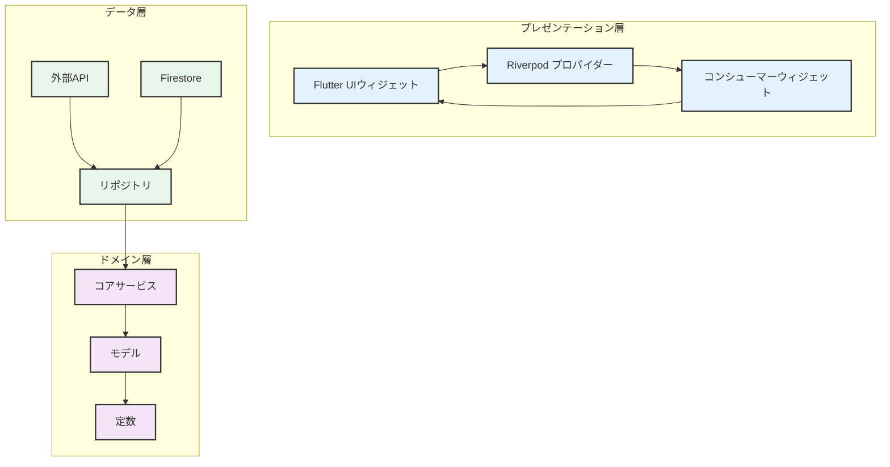
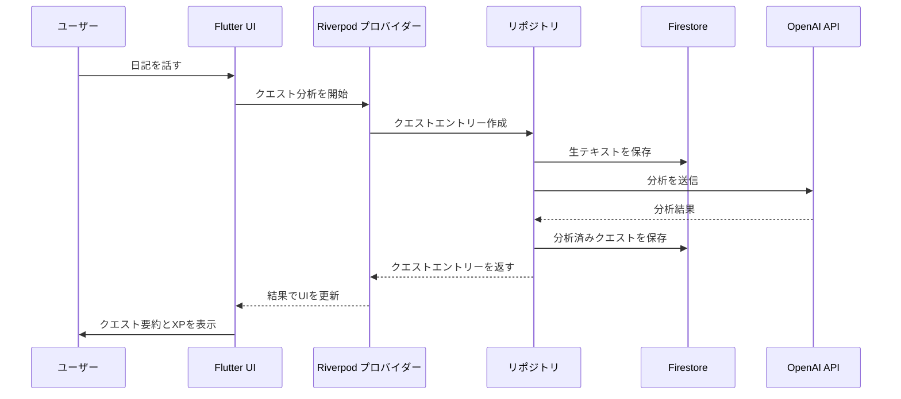
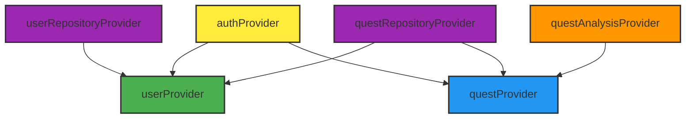
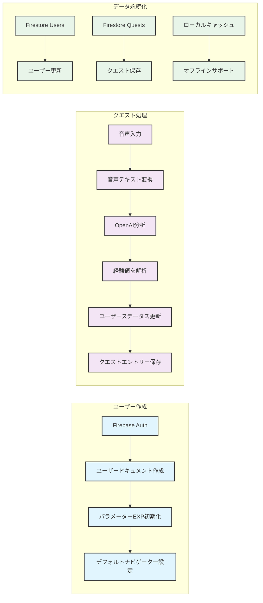
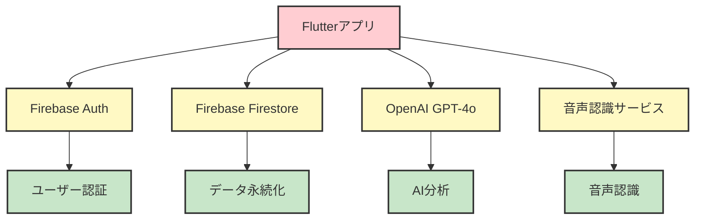
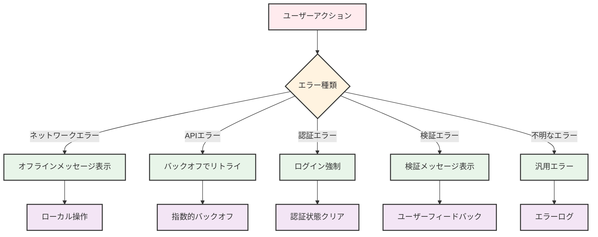

# DiaryQuest - システムアーキテクチャ

## アーキテクチャ概要

DiaryQuestは**クリーンアーキテクチャ**パターンに従っており、レイヤー間で明確な関心分離を実現しています。スケーラビリティ、保守性、テスト容易性を念頭に設計されており、FlutterのリアクティブUI機能を最大限に活用しています。



## レイヤー構造

### 1. プレゼンテーション層
**場所**: `lib/features/`, `lib/widgets/`, `lib/providers/`

**責任**:
- ユーザーインターフェースとインタラクション
- Riverpodによる状態管理
- 画面間のナビゲーション
- UIビジネスロジック

**主要コンポーネント**:
- **画面**:機能固有UI画面（HomeScreen、QuestScreenなど）
- **ウィジェット**: 再利用可能UIコンポーネント
- **プロバイダー**: Riverpod状態管理クラス
- **ナビゲーション**: 画面ルーティングと遷移

### 2. ドメイン層
**場所**: `lib/models/`, `lib/core/constants/`, `lib/core/services/`

**責任**:
- ビジネスルールとエンティティ
- アプリケーション定数と設定
- コアサービス抽象化
- データモデルと関係性

**主要コンポーネント**:
- **モデル**: User、QuestEntry、Job、Skill（不変データ）
- **定数**: パラメーター、カラー、テーマ
- **サービス**: コアサービスインターフェースと実装

### 3. データ層
**場所**: `lib/repositories/`, `lib/core/config/`

**責任**:
- データアクセスと永続化
- 外部API統合
- データ変換とキャッシュ
- リポジトリパターン実装

**主要コンポーネント**:
- **リポジトリ**: データアクセス抽象化レイヤー
- **外部API**: OpenAI、Firebaseサービス
- **設定**: アプリ設定とAPI設定

## データフローアーキテクチャ



## 状態管理アーキテクチャ

### Riverpod プロバイダー階層



### プロバイダーの責任

1. **authProvider**: Firebase認証状態
   - ユーザーログイン/ログアウトフローを管理
   - 他のプロバイダーに認証ステータスを提供
   - 認証エラーと復旧を処理

2. **userProvider**: ユーザーデータと進行状況
   - ユーザープロフィールとステータスを管理
   - 経験値計算を処理
   - 連続日数とレベルを追跡

3. **questProvider**: クエストデータと分析
   - クエスト作成と保存を管理
   - クエスト履歴とフィルタリングを処理
   - クエスト統計を提供

4. **questAnalysisProvider**: リアルタイムクエスト分析
   - 録音状態を管理
   - OpenAI APIと連携
   - 分析進行状況とエラーを処理

## コンポーネント間の関係

### ユーザーデータフロー



### 機能の組織構成

アプリケーションは機能ドメイン別に組織されています：

```
lib/features/
├── auth/           # 認証フロー
├── home/           # メインダッシュボード
├── quest/          # クエスト作成とレポート
├── job_skill/      # ジョブとスキルシステム
├── status/         # 進行状況グラフ
├── weekly_report/  # 分析
└── settings/       # ユーザー設定
```

## API統合アーキテクチャ

### 外部サービス統合



### サービスレイヤーの責任

1. **AuthService**: Firebase認証
   - ログイン/ログアウト操作を処理
   - ユーザーセッションを管理
   - ユーザー認証情報を提供

2. **OpenAIService**: AI分析統合
   - GPT-4o用プロンプトを構築
   - API通信を処理
   - 分析結果を解析

3. **SpeechService**: 音声入力処理
   - 録音状態を管理
   - 音声をテキストに変換
   - 音声許可を処理

4. **UserRepository**: データアクセス層
   - ユーザーデータのCRUD操作
   - 経験値管理
   - 連続日数追跡

5. **QuestRepository**: クエストデータ管理
   - クエスト作成と保存
   - クエスト履歴取得
   - 日付ベースフィルタリング

## データベーススキーマ

### Firestoreコレクション

#### Usersコレクション
```json
{
  "id": "user_uid",
  "email": "user@example.com",
  "displayName": "User Name",
  "selectedNavigator": "strategist",
  "totalExp": 1500,
  "consecutiveDays": 7,
  "baseLevel": 2,
  "parameterExp": {
    "analysis": 100,
    "creativity": 80,
    "expertise": 70
  },
  "unlockedSkills": ["skill_1", "skill_2"],
  "unlockedJobs": ["job_1"],
  "currentJob": "job_1",
  "createdAt": "2024-01-01T00:00:00Z",
  "lastActiveAt": "2024-01-20T12:00:00Z",
  "morningBuffEnabled": true,
  "eveningReportEnabled": true,
  "morningBuffHour": 7,
  "morningBuffMinute": 0,
  "eveningReportHour": 21,
  "eveningReportMinute": 0
}
```

#### Questsコレクション（ユーザーごとのサブコレクション）
```json
{
  "id": "quest_id",
  "userId": "user_uid",
  "createdAt": "2024-01-20T12:00:00Z",
  "rawTranscript": "Today I worked on...",
  "summary": "Completed project tasks efficiently",
  "reframedContent": "Gained valuable experience in project management",
  "earnedExp": {
    "analysis": 15,
    "speed": 10,
    "quality": 12
  },
  "totalEarnedExp": 37,
  "navigatorComment": "Great progress on analysis skills!"
}
```

## 実装されているデザインパターン

### 1. リポジトリパターン
- **目的**: ビジネスロジックとデータソースの分離
- **実装**: UserRepositoryとQuestRepositoryがFirestoreアクセスを抽象化
- **利点**: テスト容易性、複数データソース対応

### 2. プロバイダーパターン（Riverpod）
- **目的**: リアクティブ状態管理
- **実装**: 複雑な状態にはStateNotifierProvider、依存関係にはProvider
- **利点**: 自動状態更新、テスト容易性、依存性注入

### 3. ストラテジーパターン
- **目的**: ナビゲーターごとの異なる動作
- **実装**: 異なる性格を持つNavigatorType列挙型
- **利点**: 新しいナビゲーター型の追加が容易、柔軟な動作

### 4. ファクトリーパターン
- **目的**: 複雑な初期化を持つオブジェクト作成
- **実装**: Firestoreドキュメントからのモデルファクトリー
- **利点**: 集中化された作成ロジック、一貫したオブジェクト作成

### 5. オブザーバーパターン
- **目的**: リアクティブUI更新
- **実装**: Riverpodのwatch/readメカニズム
- **利点**: 状態変化時の自動UI更新

## エラーハンドリングアーキテクチャ



## パフォーマンス考慮事項

### 1. 遅延読み込み
- 機能はオンデマンドで読み込まれる
- 重いウィジェットはconstコンストラクタを使用
- 画像はアセットバンドルから読み込まれる

### 2. 状態管理
- Riverpodが不要なウィジェット再構築を防止
- 選択的状態更新が再レンダリングを最小化
- AsyncValueが読み込み状態を効率的に処理

### 3. データ最適化
- Firestoreクエリはインデックスで最適化
- ローカルキャッシュがAPI呼び出しを削減
- 大データセットのページネーション

### 4. メモリ管理
- 弱い参照がメモリリークを防止
- リソースの適切な破棄
- 画像最適化とキャッシュ

## セキュリティアーキテクチャ

### 1. 認証
- 安全なログイン用Firebase Auth
- データアクセス前のユーザーID検証
- セッション管理

### 2. データセキュリティ
- データアクセス用Firestoreセキュリティルール
- UIDによるユーザーデータ分離
- ローカルストレージに機密データなし

### 3. APIセキュリティ
- 安全に保存されたOpenAI APIキー
- 機密データの環境変数
- 乱用防止のレート制限

### 4. プライバシー
- 機密エントリーの匿名オプション
- 通信時のデータ暗号化
- GDPR準拠データ処理

## テストアーキテクチャ

### 1. 単体テスト
- サービスレイヤーロジック
- リポジトリメソッド
- プロバイダー状態管理
- モデル変換

### 2. ウィジェットテスト
- UIインタラクション
- 状態変化
- ナビゲーションフロー

### 3. 統合テスト
- 完全なユーザージャーニー
- API統合
- データベース操作

## デプロイアーキテクチャ

### 1. ビルドプロセス
- iOSおよびAndroid用Flutterビルド
- build_runnerによるコード生成
- アセットバンドルと最適化

### 2. 配布
- iOS用App Store
- Android用Google Play
- 自動化CI/CDパイプライン

### 3. モニタリング
- ユーザー行動用Firebase Analytics
- Firebase Crashlyticsによるエラー追跡
- パフォーマンスモニタリング

このアーキテクチャにより、スケーラブルで保守性が高く、機能豊富なゲーム化ジャーナリングアプリケーションの強固な基盤が提供されています。関心の分離と明確なデータフローにより、新機能の拡張とコード品質の維持が容易になっています。
